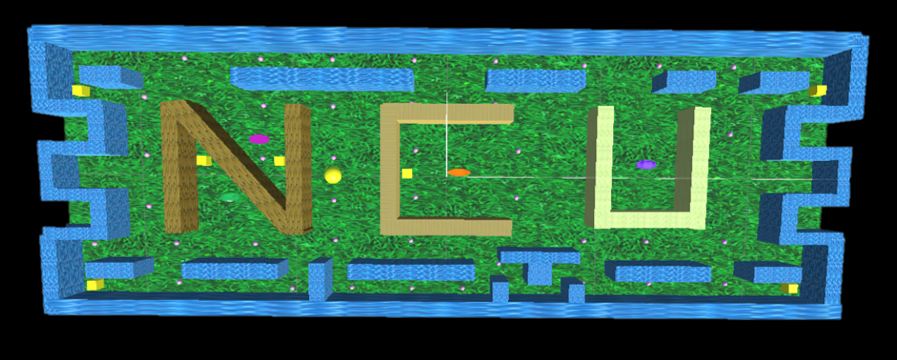
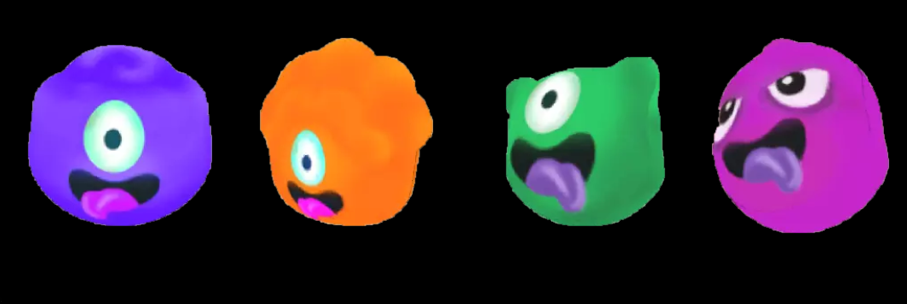
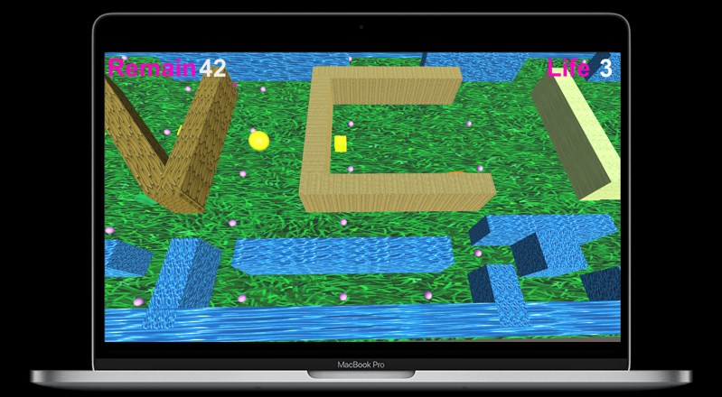

# 3D-pac-man

## Outline
1. [Introduction](#Introduction)
2. [Gameplay](#Gameplay)
3. [Difficulty](#Difficulty)
4. [Map](#Map)
5. [Monster](#Monster)
6. [Demo](#Demo)

## Introduction
&nbsp;&nbsp;3D Pac-Man is a maze chasing game. Paying tribute to the classic game Pac-Man released in 1980, 3D Pac-Man uses three-dimensional scenes to provide a more detailed and three-dimensional gaming experience, taking players back to the excitement of the Pac-Man console in the 1980s.

## Gameplay
&nbsp;&nbsp;The **elf (Pac-Man)** is located in a maze. There are 42 beans in the maze. As long as you can eat all the beans, you will win. The **starting life** is **3**. If it reaches **0**, it will fail. Besides, there are **4 other monsters** in the maze that will continue to look for the elf. 
&nbsp;&nbsp;There are 4 other monsters in the maze that will continue to look for the elves. If the elf encounters a monster, the encountered monster will return to its starting point. On the other hand, the elf returns to a random starting point and its Life is **deducted by 1**. There are two types of beans: **big beans** and **small beans**. If the player eats big beans, the monster will become smaller and the player's speed will become faster. After a while it returned to its original state.

> &nbsp;&nbsp;Game rules: There are **42 Supplies**, **7 BigSupplies**, and **4 monsters**. The 4 monsters will continue to look for the player. When the player eats BigSupply, the monsters will become smaller and the player's speed will become faster. After a period of time, they will return to their original state. Once the player eats any of **42 Supplies**, the monsters will become smaller.\
**EASY**: The player is the fastest and the 4 monsters are in the smallest size. (compared to other two scenarios)\
**MEDIUM**: Player speed is medium, the 4 monsters are in medium size. (compared to other two scenarios)\
**HARD**: The player is the slowest and the 4 monsters are in the largest size. (compared to other two scenarios)\
&nbsp;&nbsp;There are **3 life chances**. If there are 0 item left, **"Try Again"** or **"Back to Menu"** will pop up.

> &nbsp;&nbsp;If the player encounters a monster on the way, the monster encountered returns to its starting point, and the player returns to the origin spot(there are **2 origins**, and the player returns to either origin randomly). Besides, the player's life is deducted by 1.
Once you enter the game, it will show **"3 2 1 & GO"**(a total of 4 seconds including **"GO"** text appears).
During these 4 seconds, the player cannot move and the 4 monsters will not move either. Furthermore, these all can move after 4 seconds.

## Difficulty
* There are three difficulties in the game.
    * EASY: The player speed is the **fastest** and the monster size is the **smallest**(compared to other two scenarios).
    * MEDIUM: The player speed is **medium** and the monster size is in **medium**(compared to other two scenarios).
    * HARD: The player speed is the **slowest** and the monster size is the **largest**(compared to other two scenarios).

## Map

## Monster

## Demo

> **Let’s go gaming!**

## Watch the video

